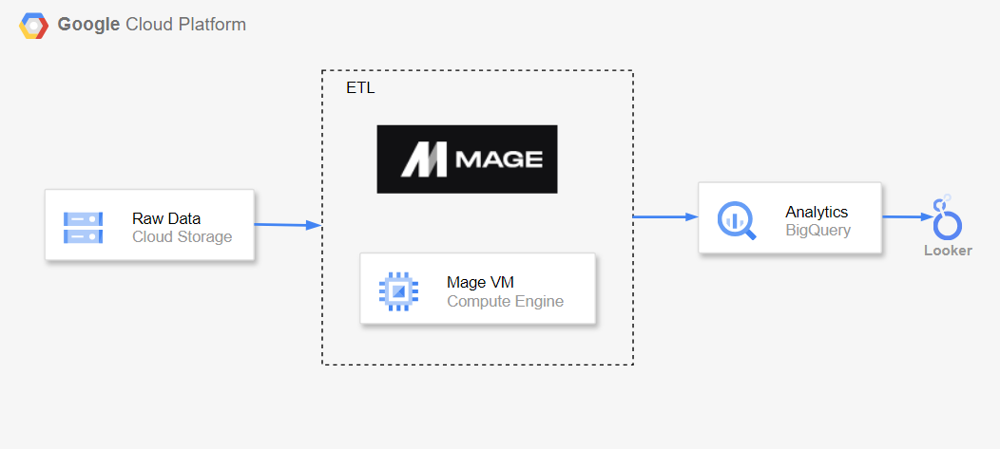
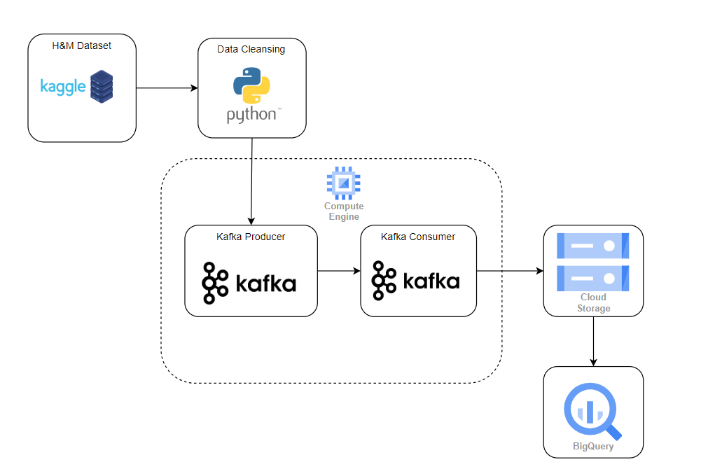

# data-engineering-portfolio

# uber data-pipeline project
- **Brief overview**: This project is a simulation of the process of data engineering from getting the source file until the data analytic stage.  
- **Technology used**: Google Cloud Platform - Cloud Storage, Compute Engine, Mage AI, Big Query, Looker Studio  
- **Outcome**: 
  - Plan stage: describe the technology used and design the data model for analytic usage
  - Implementation stage: carry out a data transformation and build a data pipeline, exporting transformed data into a data platform
  - Data Analytic stage: Perform data analysis, and present the dashboard.  

# meowfact airflow project
- **Brief overview**: This project is a simple project of using apache airflow to control the series of tasks.  
- **Technology used**: Google Compute Engines, Apache Airflow, AWS S3  
- **Outcome**:
  - Plan stage: plan for the technology used.
  - Implementation: Extract data from API, write into a file, and uplaod the file in S3, using Apache Airflow Scheduler

# HM kafka project
- **Brief overview**: This project is simulation of usage of Kafka and utilising set of cloud services tools provided by Google. 
- **Technology used**: Kafka, Google Cloud Platform - Cloud Storage, Compute Engine, Big Query 
- **Outcome**:
  - Plan stage: Design the data pipeline and data modeling the data.
  - Implementation stage: Get the datasource from kaggle, study the dataset, perform the data cleansing, create and setup instance on google compute engine, pushing file to s3 and build BigQuery table from Cloud Storage.
      
  
**Enhancement still pending to make: Automate the whole flow  
